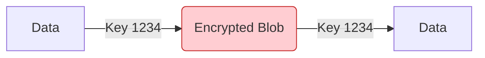
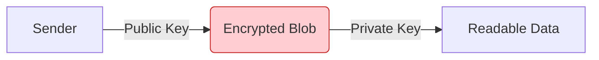

# Encryption Basics: The Keys to the Kingdom

This guide covers the two main ways we protect data: **Symmetric** and **Asymmetric** encryption.

---

## 1. Symmetric Encryption ("The Shared Secret")
Think of this like a **Hotel Safe**.
*   **The Key:** There is only **ONE** code (e.g., "1234").
*   **Action:** You use "1234" to lock the safe, and "1234" to unlock it.
*   **Pros:** Extremely **Fast**.
*   **Cons:** **Key Distribution**. How do I tell you the code is "1234" without a hacker hearing me?

**Common Algorithms:** AES (Advanced Encryption Standard).

---

## 2. Asymmetric Encryption ("Public/Private")
Think of this like a **Mailbox**.
*   **Public Key (The Slot):** Anyone can walk by and drop a letter *in*. You give this to everyone.
*   **Private Key (The Master Key):** Only the mailman (You) has the key to open the box and take letters *out*.
*   **Action:** Alice uses Bob's *Public Key* to encrypt. Only Bob can decrypt with his *Private Key*. Even Alice can't decrypt it after she sends it!
*   **Pros:** Secure key exchange (No shared secret needed).
*   **Cons:** Very **Slow** (mathematically heavy).

**Common Algorithms:** RSA, ECC (Elliptic Curve).

---

## 3. The Best of Both Worlds (TLS/HTTPS)
Because Asymmetric is slow, we only use it for the introduction.

1.  **Handshake (Asymmetric):** "Here is my Public Key. Use it to wrap up a temporary Secret Key and send it to me."
2.  **Session (Symmetric):** "Great, now we both have the Secret Key. Let's switch to AES for speed."

> **Analogy:** You use a slow, secure courier to send a briefcase containing a fast walkie-talkie. Once the other side has the walkie-talkie, you stop using the courier and just talk.
