# Networking Fundamentals for Developers: TCP/IP & Beyond

**Duration:** 4 Hours (Crash Course)
**Target Audience:** Entry-Level Developers / DevOps
**Goal:** Understand how your code talks to the world.

---

## Introduction: Why do I care?
As a developer, you write code that often lives on "Action Island" (your laptop or a server). But that code is useless if it can't talk to "Data Island" (DB, API, user). Networking is the boat that carries your data between islands. This course covers the plumbing of the internet.

---

## Module 1: The Address Layer (Where are we?)
*Time Estimate: 60 Minutes*

### 1.1 The Mental Model: OSI vs TCP/IP
Forget memorizing all 7 OSI layers for now. Focus on the **TCP/IP Model** because that's what we actually use.

*   **Application (Layer 7):** HTTP, DNS, SSH. *Your code lives here.*
*   **Transport (Layer 4):** TCP, UDP. *Ports live here (e.g., :80, :443).*
*   **Internet/IP (Layer 3):** IP Addresses. *Routing happens here.*
*   **Network Access (Layer 2):** MAC Addresses, Ethernet, WiFi. *Cables and Switches.*

### 1.2 IPv4 Addressing: The ID Card
An IPv4 address is a 32-bit unique identifier for a machine on a network.
**Format:** Dotted Decimal (e.g., `192.168.1.15`) `[0-255].[0-255].[0-255].[0-255]`

#### IP Classes (The Old Way vs New Understanding)
Historically, IPs were "Classful". Now we use CIDR (Classless Inter-Domain Routing), but the concepts remain useful for private ranges.

| Class | Range Starts With | Default Subnet | Used For |
| :--- | :--- | :--- | :--- |
| **A** | 1 - 126 | 255.0.0.0 (/8) | Massive networks (enterprises) |
| **B** | 128 - 191 | 255.255.0.0 (/16) | Mid-size networks |
| **C** | 192 - 223 | 255.255.255.0 (/24) | Small networks (Home/Labs) |

### 1.3 Subnet Masks: The Boundary
The mask tells the device: "Which part is Network (Street) vs Host (House)?"

**The Binary View (How it actually works):**
Computers don't see `255.255.255.0`. They see 1s and 0s.
*   **IP (`192.168.1.5`):** `11000000.10101000.00000001.00000101`
*   **Mask (`255.255.255.0`):** `11111111.11111111.11111111.00000000`
*   **AND Operation:** `11000000.10101000.00000001` . `00000000` (Matches first 24 bits)
*   **Result:** `192.168.1.0` (Network ID)

### 1.4 CIDR: The Modern Notation
Classful addressing wasted millions of IPs (e.g., getting a Class A gave you 16 million IPs even if you only needed 1,000). **CIDR (Classless Inter-Domain Routing)** solved this by allowing us to cut networks to the exact size we need.

**The Suffix Notation (`/xx`):**
Instead of saying "Class C" or typing out `255.255.255.0`, we use a slash followed by the number of bits turned "ON" in the mask.
*   `/8` = `255.0.0.0` (Old Class A)
*   `/16` = `255.255.0.0` (Old Class B)
*   `/24` = `255.255.255.0` (Old Class C)
*   `/25` = `255.255.255.128` (Half a Class C)

This flexibility is why we can have a `/30` network with only 4 IPs (2 usable).

> **Why only 2 usable? The "Bookends" Rule:**
> In every IPv4 subnet, the **First IP** and **Last IP** are reserved and cannot be assigned to a device.
> *   **First IP (Network ID):** This is the name of the network itself (e.g., `192.168.1.0`). It's like the street sign.
> *   **Last IP (Broadcast Address):** This is for yelling to everyone on the network (e.g., `192.168.1.255`).
>
> *Example `/30` (4 IPs Total):*
> *   `.0` -> Network ID (**Unusable**)
> *   `.1` -> Host A (Usable)
> *   `.2` -> Host B (Usable)
> *   `.3` -> Broadcast (**Unusable**)

**Quick CIDR Reference Table:**
| CIDR | Subnet Mask | Usable Hosts | Notes |
| :--- | :--- | :--- | :--- |
| **/24** | 255.255.255.0 | 254 | Standard Home/Office |
| **/25** | 255.255.255.128 | 126 | Split in half |
| **/30** | 255.255.255.252 | 2 | Point-to-Point Links (Router-to-Router) |

#### 1.4.1 Subnetting: The Art of "Borrowing Bits"
**Why do we Subnet? (The Benefits):**
1.  **Reduce Broadcast Traffic:** If one PC yells (Broadcast), only its subnet hears it. Prevents the whole network from slowing down.
2.  **Security:** Routers/Firewalls sit *between* subnets. You can block "Guests" from accessing "Finance".
3.  **Organization:** Logical grouping (e.g., WiFi Users on `.10.x`, Servers on `.20.x`).
4.  **Efficient IP Use:** Don't waste a Class A (16 million IPs) on a branch office of 50 people.

**How to Subnet:** You "borrow" bits from the Host portion and give them to the Network portion.

**Example: Creating 4 Subnets from a `/24`**
*   **Original:** `192.168.10.0/24` (8 host bits = 254 hosts).
*   **Action:** Borrow **2 bits** (2² = 4 subnets).
*   **New Mask:** `/26` (24 + 2).
*   **Result:** 4 Networks with 62 hosts each (instead of 1 network with 254 hosts).

**Real World Logic:**
*   **Traffic to same Subnet:** Switch (Direct).
*   **Traffic to different Subnet:** Router (Gateway).

### 1.5 Private vs Public IPs
> **Localhost Loopback:** `127.0.0.1` -> "Me". Traffic never leaves the device.

**Private IP Ranges (RFC 1918):**
These are free to use in your LAN. They are not routable on the public internet.
*   **Class A Private:** `10.0.0.0` - `10.255.255.255`
*   **Class B Private:** `172.16.0.0` - `172.31.255.255`
*   **Class C Private:** `192.168.0.0` - `192.168.255.255`

**Public vs Private: The Difference**
| Feature | Public IP | Private IP |
| :--- | :--- | :--- |
| **Scope** | Global (Internet) | Local (LAN/Home/Office) |
| **Uniqueness** | Must be unique worldwide. | Unique only within your network. |
| **Cost** | Paid (Leased from ISP). | Free. |
| **Routing** | **Routable** on the Internet. | **Not Routable** (Dropped by Internet routers). |
| **Example** | `8.8.8.8` (Google) | `192.168.1.5` (Your Laptop) |

### 1.6 IPv6 Overview (The Future is Now)
We ran out of IPv4 addresses. Hacky fixes like NAT kept us going, but IPv6 is the real solution.
*   **Size:** 128-bit address (Huge).
*   **Format:** Hexadecimal (e.g., `2001:0db8:85a3::8a2e:0370:7334`).
*   **Fact:** No need for NAT (Every device can have a public IP).
*   **Localhost:** `::1`

---
[End of Module 1]

## Module 2: The Plumbing (Switching & Routing)
*Time Estimate: 60 Minutes*

### 2.1 Layer 2: The Local Network (Switching)
Inside your office or home, you are on a **LAN** (Local Area Network). Devices here talk via **MAC Addresses** (Burned-in physics ID), not IP addresses.

*   **Switch:** Connects devices in the *same* network. It learns MAC addresses to send data to the right port.
*   **Broadcast Storms:** If you loop cables, traffic spins forever. STP (Spanning Tree Protocol) blocks ports to prevent this logic loop.

### 2.2 ARP: The Glue (IP -> MAC)
When you type `ping 192.168.1.50`, your computer knows the IP, but the switch only understands MAC addresses.
**ARP (Address Resolution Protocol):**
1.  **You scream:** "Who has 192.168.1.50?" (Broadcast `FF:FF:FF:FF:FF:FF`)
2.  **Victim replies:** "I do! My MAC is AA:BB:CC:11:22:33"
3.  **You:** Save that to your **ARP Table** (cache) and send the data.

### 2.3 Layer 3: Routing (Leaving the Local Network)
To talk to google.com, you need to leave your LAN. You need a **Router**.
**The Default Gateway:** The "door" out of your network (usually `192.168.1.1`).

**Routing Decision Logic (The Journey):**
How does a packet get from **Client C** (Left) to **Server S** (Right) and back?

**The Logical "Brains" of the Routers:**

**Router R1 Table (Deciding for Client):**
| Destination Network | Next Hop IP | Interface | Notes |
| :--- | :--- | :--- | :--- |
| `10.1.1.0/24` (Client) | **Direct** | g0 | It's my local LAN |
| `10.1.20.0/24` (Server) | `10.12.0.2` (R2) | g1 | **Specific Route** (Primary) |
| `10.1.20.0/24` (Server) | `10.12.0.6` (BR) | g2 | Backup Route (Higher Cost) |
| `0.0.0.0/0` (Internet) | `ISP_IP` | g3 | Default Gateway |

> **Wait, why 10.12.0.6? (Subnet Math Check)**
> We used a `/30` network for the link between routers.
> *   **Network:** `10.12.0.4` (The Street Name - No packets here).
> *   **R1 Interface:** `10.12.0.5` (Our IP).
> *   **BR Interface (Next Hop):** `10.12.0.6` (The Neighbor's IP).
> *   **Broadcast:** `10.12.0.7` (Yells to everyone - **Not valid for Routing**).
>
> *Rule: You always route to a **Specific IP**, never the Network ID or Broadcast ID.*

**Router BR Table (The Bridge):**
| Destination Network | Next Hop IP | Interface | Notes |
| :--- | :--- | :--- | :--- |
| `10.1.1.0/24` (Client) | `10.12.0.5` (R1) | g0 | Path Back |
| `10.1.20.0/24` (Server) | `10.12.0.10` (R2) | g1 | Path Forward |

**Router R2 Table (Deciding for Server):**
| Destination Network | Next Hop IP | Interface | Notes |
| :--- | :--- | :--- | :--- |
| `10.1.20.0/24` (Server) | **Direct** | g0 | It's my local LAN |
| `10.1.1.0/24` (Client) | `10.12.0.1` (R1) | g1 | Return Path |

**Step-by-Step Flow (The Round Trip):**

**1. Forward Path (Client -> Server)**
*   **Goal:** Client C (`10.1.1.100`) needs to reach Server S (`10.1.20.100`).
*   **Hop 1 (Local - The Decision):**
    *   **Calculation:** Client C checks destination `10.1.20.100`.
    *   **Result:** "State 20 is NOT in my local network (`10.1.1.x`). It is **Remote**."
    *   **Action:** "I must send this to my **Default Gateway** (`10.1.1.1`), which is Router R1."
    *   *Mechanism:* C ARPs for R1's MAC address and sends the frame there.
*   **Hop 2 (R1 Decision):**
    *   R1 Routing Table has multiple paths.
    *   It checks destination `10.1.20.100`.
    *   It chooses the direct link to **R2** (`10.12.0.0/30`) via interface `g1` because it is the **shortest/best metric path**.
    *   *Note: It usually avoids the path via BR unless the direct link is down.*
*   **Hop 3 (R2 Delivery):** R2 sees `10.1.20.100` is on its local interface `g0`. Delivers packet to Server S.

**2. Return Path (Server -> Client)**
*   **Goal:** Server S replies to `10.1.1.100`.
*   **Hop 1 (Local):** S sends reply to Default Gateway **R2**.
*   **Hop 2 (R2 Decision):**
    *   R2 Routing Table looks for `10.1.1.100`.
    *   It sends packet back to **R1** (`10.12.0.1`).
*   **Hop 3:** R1 delivers locally to Client C.

### 2.4 NAT: Infrastructure Essentials
**Problem:** There are billions of devices, but you only get 1 Public IP from your ISP.
**Solution:** NAT acts as the front desk receptionist.
*   **Outgoing:** Router rewrites your private IP (`192.168.1.5`) to its Public IP (`203.0.113.10`).
*   **Incoming:** Router remembers who asked for google.com and forwards the reply back to *you*.

---
[End of Module 2]

## Module 3: Transport Layer (How we get there reliably)
*Time Estimate: 60 Minutes*

### 3.1 UDP vs TCP
*   **UDP (User Datagram Protocol):** "Unreliable".
    *   No guarantee of arrival. No reordering. Fire and forget.
    *   **Use Cases:** DNS, Video Streaming, Gaming (Speed > Accuracy).
*   **TCP (Transmission Control Protocol):** "Reliable".
    *   Guarantees delivery, ordering, and error-checking.
    *   **Use Cases:** Web (HTTP), Email, File Transfer.

### 3.2 The TCP 3-Way Handshake
Before sending data, TCP must "establish a connection".
1.  **SYN (Synchronize):** "Hi, I want to talk! My Sequence is 0."
2.  **SYN-ACK:** "I hear you! My Sequence is 0. I expect your next byte to be 1 (ACK)."
3.  **ACK:** "Great, let's go!"

### 3.3 Reliability Mechanics
*   **Sequence Numbers:** Every byte is numbered. If packets arrive out of order (1, 3, 2), TCP puts them back in order (1, 2, 3).
*   **Packet Loss & Retransmission:** If I send Packet 5 and don't get an ACK, I wait specific time and send it again.
*   **Flow Control (Windowing):** "I can handle 10KB right now". Adjusts speed so the receiver isn't overwhelmed.

> **Note on Optimization:** Algorithms like *Cubic* or *BBR* exist to optimize how fast we ramp up speed, but the core mechanic is the same: "Don't send more than the pipe can hold."

---

## Practical Lab #1: Capturing the Handshake
**Goal:** See the SYN/ACK flags in real life.
**Prerequisite:** Install [Wireshark](https://www.wireshark.org/).

1.  Open Wireshark and select your active network interface (WiFi/Ethernet).
2.  In the filter bar, type: `tcp.port == 80`.
3.  Start Capture (Blue Shark fin).
4.  Curl `http://example.com` (Use HTTP, not HTTPS for easier initial viewing).
5.  Stop Capture.
6.  **Analyze:**
    *   Look for the first 3 packets.
    *   **Packet 1:** Info says `[SYN]`. Expand "Transmission Control Protocol" -> Flags.
    *   **Packet 2:** Info says `[SYN, ACK]`.
    *   **Packet 3:** Info says `[ACK]`.

---
[End of Module 3]

## Module 4: The Application Layer (Data Island)
*Time Estimate: 60 Minutes*

### 4.1 DNS: The Internet's Phonebook
Computers need IPs (`1.1.1.1`), but humans prefer names (`google.com`).
**DNS (Domain Name System)** maps names to IPs.

**Common Record Types:**
*   **A Record:** Name -> IPv4 (`example.com` -> `93.184.216.34`)
*   **AAAA Record:** Name -> IPv6
*   **CNAME:** Nickname (`www.google.com` -> `google.com`)

### 4.2 HTTP & HTTPS
*   **HTTP:** Plain text. (The mailman reads your postcards).
*   **HTTPS (TLS):** Encrypted. (The mailman sees the envelope, but not the letter).
    *   **TLS Handshake:** Adds 1-2 extra round trips before data flows. Secure, but slightly slower startup.

#### The TLS 1.3 Handshake (Simplified)
Before HTTP data is sent, we must agree on a secret code (encryption key).

```mermaid
sequenceDiagram
    participant Client
    participant Server
    
    Note over Client, Server: 1. TCP Handshake (SYN/ACK) Complete
    
    Client->>Server: Client Hello (I support TLS 1.3, Cipher Suites, Random)
    Server->>Client: Server Hello (Let's use AES-256, Here is my Cert + Key Share)
    
    Note right of Client: Client Logic:<br>1. Validates Cert<br>2. Generates Session Keys
    
    Client->>Server: Finished (Encrypted)
    Server->>Client: Finished (Encrypted)
    
    Note over Client, Server: Connection Secure! 🔒
    
    Client->>Server: GET /login (Encrypted)
    Server-->>Client: 200 OK (Encrypted)
```

**Key Steps:**
1.  **Client Hello:** "I speak these languages (Ciphers). What do you speak?"
2.  **Server Hello:** "Let's speak *this* one. Here is my ID (Certificate) to prove I am Google."
3.  **Key Exchange:** Both sides do math to create a shared secret key *without* sending the key itself over the wire (Diffie-Hellman).
4.  **Encrypted Traffic:** Now everything looks like gibberish to a hacker.

#### Practical Lab #3: Inspecting TLS Handshake
**Goal:** Capture the "Hello" messages and see the encryption start.
**Tools:** Wireshark & Terminal (curl).

1.  **Preparation:**
    *   Close other browser tabs (to reduce noise).
    *   Open Wireshark and select your active interface.
    *   **Filter:** `tls.handshake.type == 1` (This filters specfically for Client Hello) OR just `tcp.port == 443`.
2.  **Capture:**
    *   Start Capture.
    *   Open Terminal/Command Prompt.
    *   Run: `curl -v https://example.com`
    *   Stop Capture.
3.  **Analysis:**
    *   Look for the packet labeled **Client Hello**.
        *   Expand **Transport Layer Security** -> **TLSv1.3 Record Layer** -> **Handshake Protocol** -> **Client Hello**.
        *   Find **Cipher Suites**: This is the list of languages your computer speaks (e.g., `TLS_AES_256_GCM_SHA384`).
        *   Find **Extension: server_name**: This shows `example.com` (SNI). *Note: This is visible even in HTTPS!*
    *   Look for the packet labeled **Server Hello**.
        *   See which **Cipher Suite** the server chose.
    *   Look at the next packets: **Application Data**. It's all scrambled!

#### Advanced Lab: Decrypting TLS Traffic (The Magic Trick)
**Goal:** Make Wireshark show you the unencrypted HTTP traffic inside the TLS tunnel.
**How:** We will force the browser/curl to dump the "Session Keys" to a file, and tell Wireshark to read them.

1.  **Set the Key Log Variable:**
    *   **Windows** `SSLKEYLOGFILE = "C:\Temp\sslkeylog.log"`
2.  **Configure Wireshark:**
    *   Go to **Edit -> Preferences -> Protocols -> TLS**.
    *   In **(Pre)-Master-Secret log filename**, browse and select your `sslkeylog.log` file.
3.  **Capture & Generate Traffic:**
    *   Start Capture
    *   **Crucial:** Launch your browser from within wireshark launch command.
    *   Run: `https://httpbin.org`
    *   Stop Capture.
4.  **The Reveal:**
    *   Look at your packet list. You will now see green **HTTP** packets *instead* of just TLS Application Data.
    *   You can see the `GET /` and the HTML response!
    *   *Note: This works because you owned the client endpoint and forced it to give up its secrets.*

**Protocols Evolution:**
*   **HTTP/1.1:** One request at a time properly line. "Head of Line Blocking" if one image is slow.
*   **HTTP/2:** Multiplexing. Send 10 images at once over 1 connection.
*   **QUIC (HTTP/3):** Runs over **UDP**! Solves TCP blocking issues.

### 4.3 Practical Lab #2: HTTP & DNS Inspection
**Goal:** See the difference between a clean 200 OK and an error, and watch DNS happen.
**Tools:** Wireshark & Browser.

1.  **Start Wireshark Capture** (Filter: `port 53 or tcp.port == 80`).
    *   *Port 53 is DNS, Port 80 is insecure HTTP.*
2.  **DNS Check:**
    *   Open command prompt. Run: `ping httpbin.org`.
    *   Stop Capture. Look for `DNS` protocol packets. Standard Query A `httpbin.org`.
3.  **HTTP Status Codes (The Conversation):**
    *   Start Capture again. Filter: `tcp.port == 80`.
    *   Visit: `http://httpbin.org/status/200`
        *   **Look for:** `HTTP/1.1 200 OK`.
    *   Visit: `http://httpbin.org/status/404`
        *   **Look for:** `HTTP/1.1 404 NOT FOUND`.
    *   Visit: `http://httpbin.org/status/500`
        *   **Look for:** `HTTP/1.1 500 INTERNAL SERVER ERROR`.

---
## Summary
1.  **IP Addresses** locate the computer.
2.  **MAC Addresses** locate the hardware locally.
3.  **TCP** ensures the data arrives perfectly.
4.  **DNS** finds the IP for a name.
5.  **HTTP** is the language your app speaks.

**Next Steps:** Use `curl -v` in your terminal to practice debugging headers!

---

## Appendix: Practice Exercises

### Exercise 1: Identifying the Network ID
**Formula:** `IP Address` AND `Subnet Mask` = `Network ID`.

**Solved Example:**
*   **Problem:** Find the Network ID for IP `192.168.10.55` with mask `255.255.255.0` (/24).
*   **Method 1: Binary (The Real Logic):**
    *   IP: `11000000.10101000.00001010.00110111`
    *   Mask: `11111111.11111111.11111111.00000000`
    *   AND: `11000000.10101000.00001010.00000000` (First 24 bits kept, last 8 zeroed)
    *   Result: `192.168.10.0`
*   **Method 2: Common Sense (The Shortcut):** The mask `/24` freezes the first 3 numbers (`192.168.10`). It sets the last number to 0.
*   **Solution:** `192.168.10.0`
*   **Range:** `.1` to `.254`.

**Practice Problems for Students:**
1.  **IP:** `10.50.4.20`, **Mask:** `255.255.0.0` (/16). Find the Network ID.
2.  **IP:** `172.16.99.15`, **Mask:** `255.255.255.0` (/24). Find the Network ID.

---

### Exercise 2: CIDR & Subnetting Logic
**Goal:** Understand how many IPs are available in a CIDR block.

**Solved Example:**
*   **Problem:** You have a `/30` link. How many usable host IPs do you have?
*   **Step-by-Step Approach:**
    1.  **Identify Total Bits:** An IPv4 address always has **32 bits**.
    2.  **Find Net vs Host:** The CIDR is `/30`. This means 30 bits are for the Network.
    3.  **Calculate Host Bits:** `32 (Total) - 30 (Network) = 2 Host Bits`.
    4.  **Calculate Total Combinations:** Rules of binary say `2^Bits` (2 to the power of 2) = **4 Total IPs**.
    5.  **Subtract Reserved IPs:** You always lose 2 IPs (One for Network ID, One for Broadcast).
    6.  **Final Formula:** `(2^2) - 2` = **2 Usable IPs**.
*   **Answer:** 2 Usable IPs.

**Practice Problems for Students:**
1.  **Problem:** A cloud provider gives you a `/29` subnet. How many usable IPs do you have?
2.  **Problem:** You need to fit **50 hosts** in a subnet. Is a `/26` big enough? (Hint: Calculate 2^6).
3.  **Design Problem (Open Ended):** You are designing a network for a small office.
    *   **Requirements:** 100 Employees (1 Laptop each) + 20 Office Printers + 10 WiFi Access Points.
    *   **Question:** Suggest the **smallest** CIDR block (e.g., `/24`, `/25`, `/26`) that fits all these devices with some room for growth. Explain why.

---

### Exercise 3: Valid Host Ranges (The DHCP Problem)
**Goal:** Determine the First and Last usable IP for a network.
**Formula:** `First = Network + 1`, `Last = Broadcast - 1`.

**Solved Example:**
*   **Problem:** Find the valid range for `192.168.10.0/24`.
*   **Logic:**
    *   Network: `192.168.10.0`
    *   Broadcast: `192.168.10.255` (Last possible number).
    *   First Usable: `.1`
    *   Last Usable: `.254`
*   **Answer:** `192.168.10.1 - 192.168.10.254`

**Practice Problem:**
1.  **Problem:** You have network `10.0.0.0/30`. What are the ONLY two valid IPs you can assign to routers?

---

### Exercise 4: "Can They Talk?" (Troubleshooting)
**Goal:** Determine if two devices can communicate directly (Switch) or need a Router.

**Solved Example:**
*   **Scenario:**
    *   PC A: `192.168.1.10 /24`
    *   PC B: `192.168.5.10 /24`
*   **Logic:**
    *   PC A Network: `192.168.1.x`
    *   PC B Network: `192.168.5.x`
    *   Match? **No.**
*   **Answer:** They are **Remote**. Traffic must go to the Gateway.

**Practice Problem:**
1.  **Scenario:**
    *   Server A: `10.50.0.5 /16`
    *   Server B: `10.50.100.20 /16`
    *   **Question:** Can they talk directly via a Switch? (Yes/No).
