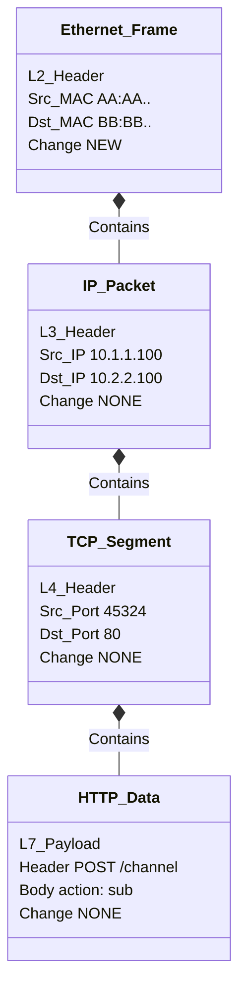
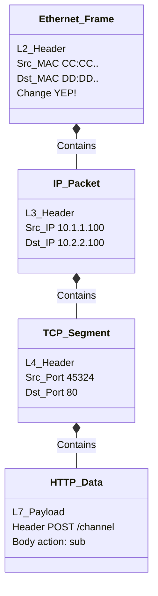
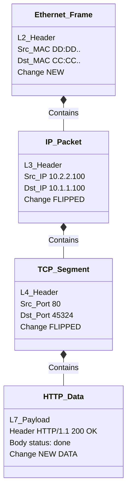
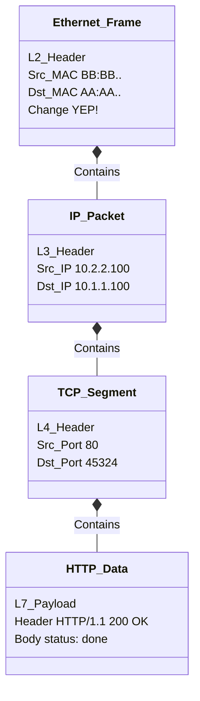

# Packet Life Cycle: Header Changes Per Hop

This guide explains how **Ethernet (MAC)**, **IP**, **TCP**, and **HTTP** headers change (or don't) as a packet travels from a source to a destination and back.

## The Rule of Thumb

1.  **Ethernet Header (MAC):** Changes at **every hop** (every router). It only cares about the *immediate next device*.
2.  **IP Header (IP Addr):** Stays **constant** from Source to Destination (ignoring NAT). It cares about the *final destination*.
3.  **TCP Header (Ports):** Stays **constant** from Source to Destination. It cares about the *specific application* process.
4.  **HTTP Header & Body:** Stays **constant**. This is the message inside the envelope.

---

## The Scenario

**Topology:**
`[Client A]` --(Network 1)-- `[Router R1]` --(Network 2)-- `[Server B]`

**Devices & Addresses:**

| Device | Role | IP Address | MAC Address | Port Used |
| :--- | :--- | :--- | :--- | :--- |
| **Client A** | Sender | `10.1.1.100` | `AA:AA:AA:AA:AA:AA` | `45324` (Random) |
| **Router R1** | Input (LAN) | `10.1.1.1` | `BB:BB:BB:BB:BB:BB` | - |
| **Router R1** | Output (WAN)| `10.2.2.1` | `CC:CC:CC:CC:CC:CC` | - |
| **Server B** | Receiver | `10.2.2.100` | `DD:DD:DD:DD:DD:DD` | `80` (HTTP) |

---

## 1. Forward Path (Client -> Server)

### Hop 1: Client A sends to Router R1
Client A sends a POST request. The entire stack below represents **ONE single Ethernet Frame** on the wire.

*   **Ethernet:** Encapsulates the IP Packet.
*   **IP:** Encapsulates the TCP Segment.
*   **TCP:** Encapsulates the HTTP Data.

### Hop 2: Router R1 sends to Server B
R1 forwards the packet. It removes the old Ethernet envelope and puts the IP Packet into a NEW Ethernet envelope.

*   **Ethernet:** "Take to Server B (DD)." (**CHANGED**)
*   **IP:** Unchanged.
*   **TCP:** Unchanged.
*   **HTTP:** Unchanged.

---

## 2. Return Path (Server -> Client)

Server B sends a 200 OK reply. Data flows back.

### Hop 3: Server B sends to Router R1
*   **Ethernet:** "Take to R1 (CC)."
*   **IP:** "Src=Server, Dst=Client". (**FLIPPED**)
*   **TCP:** "Src=80, Dst=45324". (**FLIPPED**)
*   **HTTP:** "200 OK" (New Payload).

### Hop 4: Router R1 sends to Client A
*   **Ethernet:** "Take to Client A (AA)." (**CHANGED**)
*   **IP:** Unchanged.
*   **TCP:** Unchanged.
*   **HTTP:** Unchanged.

