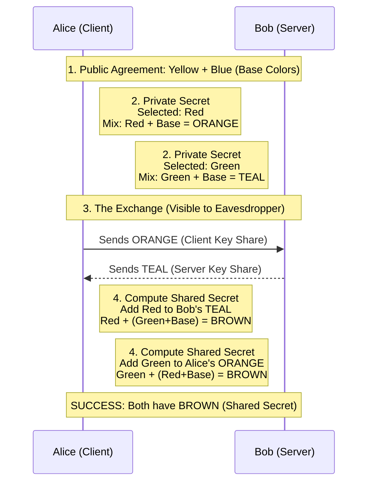

# TLS Handshake Analogy: Diffie-Hellman with Paint Colors

This document explains the TLS handshake mechanism using the classic "paint mixing" analogy for the Diffie-Hellman key exchange.

## The Scenario
Imagine **Alice** (client) and **Bob** (server) want to agree on a shared secret color, but they are communicating in public where anyone (an eavesdropper) can see what they send to each other.

### 1. Public Agreement
Alice and Bob agree on public starting values. Everyone knows these, including any eavesdroppers.
*   **Yellow paint** + **Blue paint** (These represent the Diffie-Hellman group/curve parameters).

### 2. Private Secrets
Both Alice and Bob pick a secret color that they keep to themselves.
*   **Alice** picks a secret: She adds a lot of **Red paint** (her private key) to the public mix → Result: **Orange-ish** mixture.
*   **Bob** picks a secret: He adds a lot of **Green paint** (his private key) to the public mix → Result: **Teal-ish** mixture.

### 3. The Exchange
They swap their mixed colors over the public network.
*   Alice sends her **Orange** mixture to Bob.
*   Bob sends his **Teal** mixture to Alice.

*(An eavesdropper sees Orange and Teal flying over the network but can't un-mix them to figure out the exact secret amounts of Red or Green used.)*

### 4. Computing the Shared Secret
Now, both Alice and Bob perform the final mixing step in private.
*   **Alice** takes Bob's **Teal** mixture and adds her own secret **Red** paint → Result: **Brown**.
*   **Bob** takes Alice's **Orange** mixture and adds his own secret **Green** paint → Result: The exact same **Brown**!

### Conclusion
Alice and Bob now have an identical shared secret color (**Brown**) that no one else knows, even though they never exchanged the secret parts (Red and Green) directly.

### Visual Sequence Diagram

---

## Technical Translation (TLS 1.3)
Here is how this analogy maps to the actual TLS 1.3 protocol:

*   **The "Orange" mixture**: This corresponds to the **Client's Key Share** (sent in the `ClientHello` message).
*   **The "Teal" mixture**: This corresponds to the **Server's Key Share** (sent in the `ServerHello` message).
*   **The "Brown" mixture**: This is the **Shared Secret** (Premaster Secret) that both parties compute independently.
*   **Final Key Generation**: Both parties then use **HKDF** (a keyed-hashing for pseudo-random functions) to turn that "Brown" shared secret into the real symmetric encryption keys used to secure the session.
